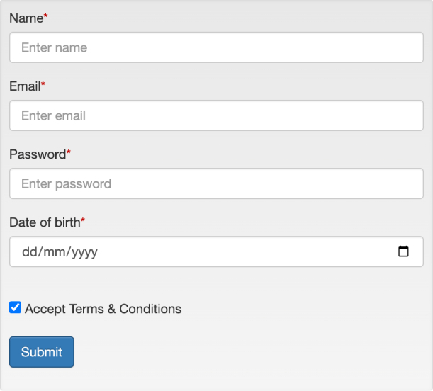

# Text

In this lesson, we will create our first form using the HTML `form` element.

## Prerequisites

1. Understanding of Basic HTML
2. Understanding of CSS
3. Knowledge of HTTP basics

## Design



## Script

First, let us create a `form` element as a wrapper for all the controls we build for this HTML Form.

> Action: Open an editor and create a form element as below

```js
<form>#form controls</form>
```

Next, let us create the controls one by one. We will start with the Name input field. It is a text-only input field, so we will create an input element of the type set to text. We will also create a `label` for all the input elements as per the design.

```js

<form>
   <label for="name">Name</label>
   <input type="text" id="name" name="name">
</form>

```

Next, we will create the email input field. It is an email-only input field, so we will create an input element of the type set to email.

```js

<form>
   <label for="email">Email</label>
   <input type="email" id="email" name="email">
</form>

```

Next, we will create the password input field. It is a password-only input field, so we will create an input element of the type set to password.

```js

<form>
   <label for="password">Password</label>
   <input type="password" id="password" name="password">
</form>

```

Next, we will create the Date of birth input field. It is an input field which gives you the ability to pick a date using the date picker. We will use the input type as the date for this control.

```js

<form>
   <label for="dob">Date of Birth</label>
   <input type="date" id="dob" name="dob">
</form>

```

Next, we will create the 'Accept Terms & Conditions' checkbox. The input field of type `checkbox` is used to create one. Checkboxes are generally used to let a user select one or more options.

```js

<form>
   <input type="checkbox" id="acceptTerms" name="acceptTerms">
   <label for="acceptTerms">Accept Terms & Conditions</label>
</form>

```

Finally, let's add a Submit button that lets the user send this data collected to a web server. We can create a button using the `button` element. The `type` attribute of the button is used to define the action associated with it. In our case, as we are creating a form to submit user data, we will use the type `submit`.

```js
<form>
  <button type="submit">Submit</button>
</form>
```

The final HTML for the form we created will look something like the one below:

```js

<form>
   <label for="name">Name</label>
   <input type="text" id="name" name="name">

   <label for="email">Email</label>
   <input type="email" id="email" name="email">

   <label for="password">Password</label>
   <input type="password" id="password" name="password">

   <label for="dob">Date of Birth</label>
   <input type="date" id="dob" name="dob">

   <input type="checkbox" id="acceptTerms" name="acceptTerms">
   <label for="acceptTerms">Accept Terms & Conditions</label>

   <button type="submit">Submit</button>
</form>

```

There are multiple other form controls that HTML provides, and you can use them in your applications based on your requirements. You can refer to the details of the same [here](https://www.w3schools.com/html/html_form_elements.asp).

In the upcoming lessons, we will learn about validating the input entered by the user and how user data is submitted to a web server.
